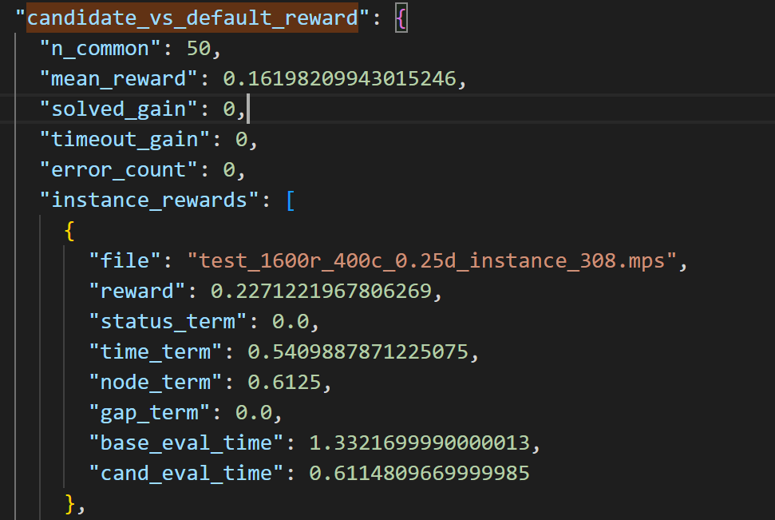

# EvolveMip
<<<<<<< HEAD
A frame using LLM and Reward evaluating frame to accelarate Mip Solving time

## Set Cover 上基于 SCIP 的 Branchrule 优化框架：阶段摘要

目标

面向 set cover 数据集，构建一个基于 SCIP / PySCIPOpt 的 branchrule 优化实验框架，用于：

评估自定义 branching strategy
构建可解释的 reward 反馈
为后续 LLM 自动生成 branchrule 提供标准评测闭环
当前已完成内容
1. 统一求解与评测框架

已完成：

solve_mps(...)
benchmark_branchrule(...)
benchmark_default(...)
summarize_results(...)

支持三方比较：

SCIP default
baseline branchrule
candidate branchrule
2. Solver setup 已固定

在 solve_mps() 中统一采用 reduced-interference 设置：

禁用 presolving
禁用 separation / cutting planes
降低默认强 branching rules 的优先级

目的是尽量隔离 branchrule 对搜索树和求解过程的贡献。

3. 实例 profiling 与数据筛选已完成

从大量 set cover MPS 中抽样 profiling 后，已经确认数据集具有明显的搜索难度分布，适合 branchrule 学习。

当前实例分类结果表明：

当前 profiling 结果如下：

hard_timeout: 399
hard_timeout_small_gap: 58
hard: 175
medium: 229
easy: 63
too_easy: 74
error: 2

medium / hard / hard_timeout 占多数
too_easy 占比较低
数据集对 branching 策略是有信号的

已具备：

dev_pool 实验
holdout_pool 验证
stress_pool（可选） 

4. Reward 框架已完成并验证有效

当前 reward 综合考虑：

solved / timeout 状态变化
cpu_process_time
nnodes
timeout 下的 gap
error 重罚

特点：

逐实例计算，再聚合平均
主时间指标使用 cpu_process_time
reward 已在手工 candidate 上验证，能够稳定区分不同策略优劣
5. 手工候选规则测试已跑通

在未接入 LLM API 前，已通过多组手工 branchrule 候选验证：

benchmark 有区分度
reward 有分辨力
candidate 相对 baseline / default 已出现真实改进

部分结果显示：

candidate_vs_default_reward 为正
且大多数实例 reward 为正
改进主要来自求解时间和节点数下降

这说明当前框架不仅“能跑”，而且已经能反映 branchrule 质量差异。

>>>>>>> 36c69ee (save local changes before rebase)

